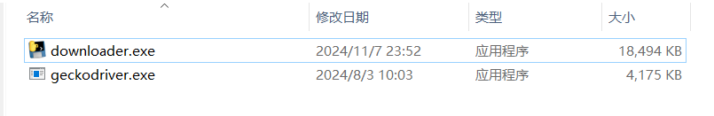
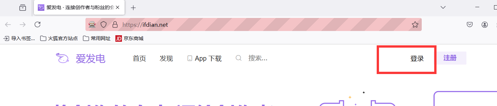
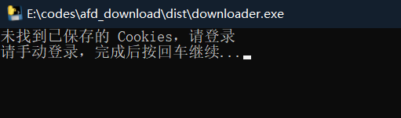
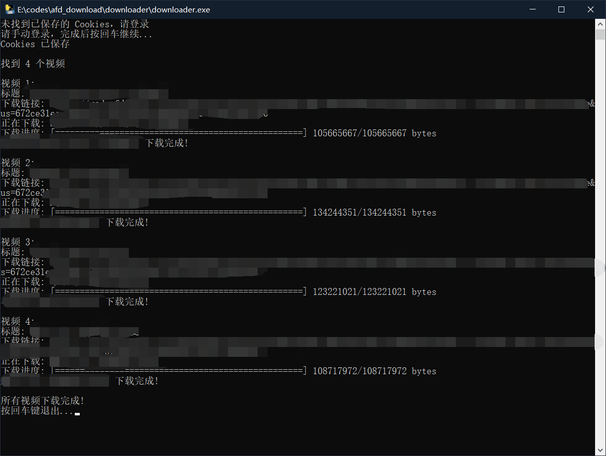
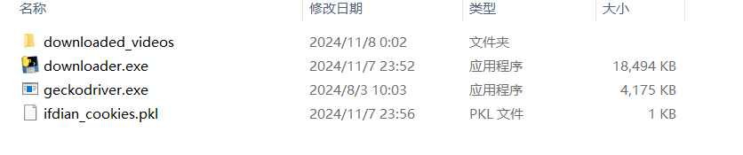

# 爱发电收藏视频下载器 (afd_mark-post_downloader)

一个简单易用的爱发电收藏视频批量下载工具。

## 🚀 快速开始

### 1. 准备工作

将下载器和 Firefox 驱动放在同一目录下：
- `爱发电视频下载器.exe`
- `geckodriver.exe`

### 2. 首次使用

1. 首次运行时，程序会自动打开爱发电登录页面
2. 请完成手动登录以获取必要的登录凭证
3. 登录完成后，返回程序窗口点击回车继续

### 3. 开始下载

- 登录成功后，程序会自动获取您收藏的所有视频
- 下载进度会实时显示在控制台窗口中
- 您可以随时查看下载状态和进度

### 4. 下载完成

- 所有下载的视频将保存在 `downloaded_videos` 目录中
- 视频文件会以原始标题命名，方便管理和查找

## ✨ 特性

- 🔄 自动保存登录状态，无需重复登录
- 📁 自动创建下载目录
- 📊 实时显示下载进度
- 🎯 支持批量下载所有收藏视频

## 📝 注意事项

1. 确保您的电脑已安装 Firefox 浏览器
2. 保持网络连接稳定
3. 确保磁盘有足够的存储空间

## 🤝 贡献

欢迎提交 Issues 和 Pull Requests 来帮助改进这个项目！

## 📜 许可证

[MIT License](LICENSE)
